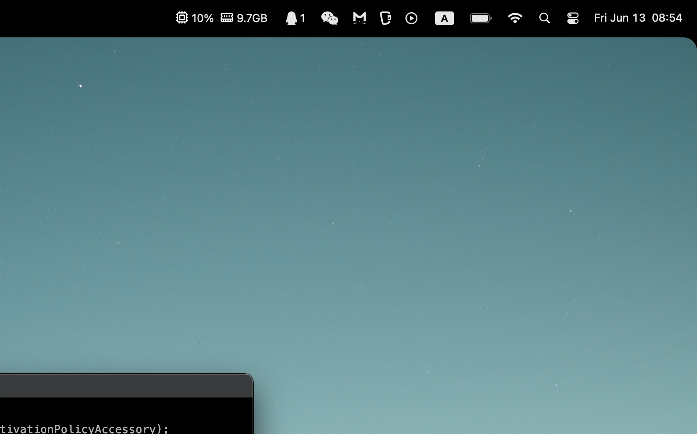
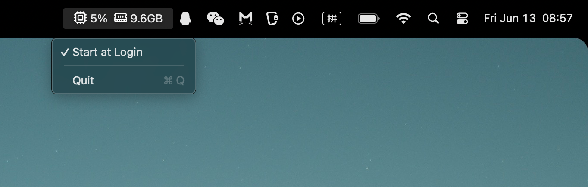
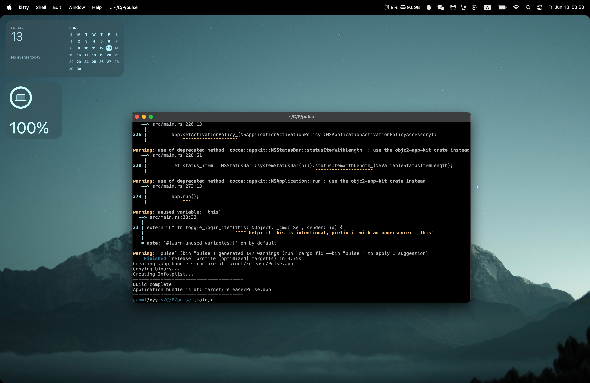
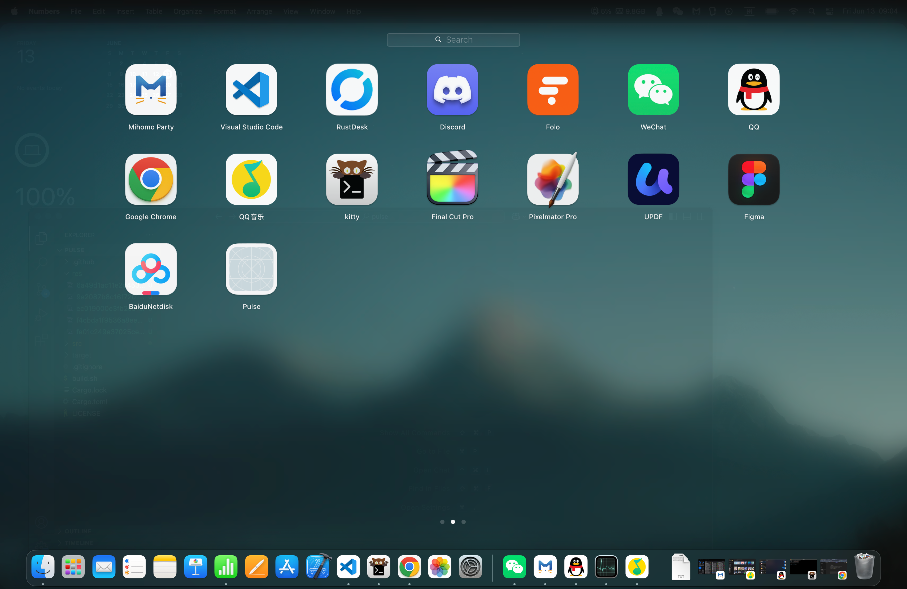
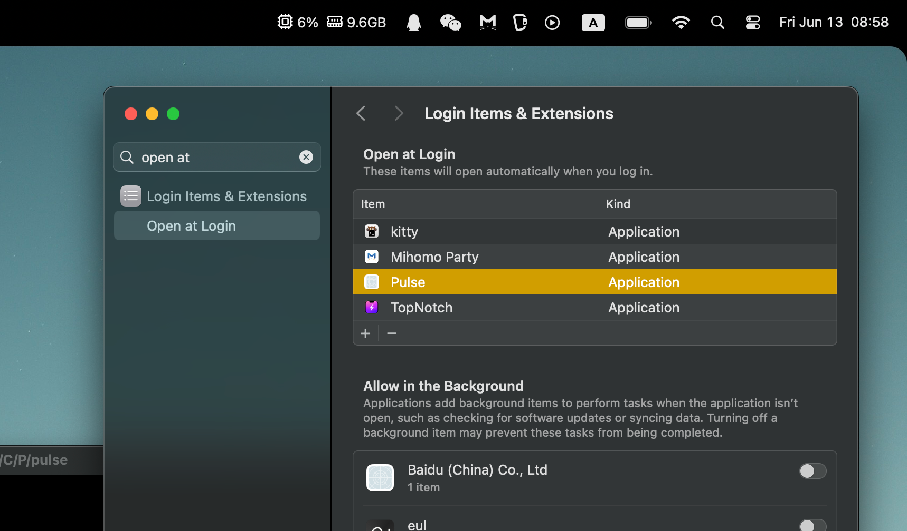
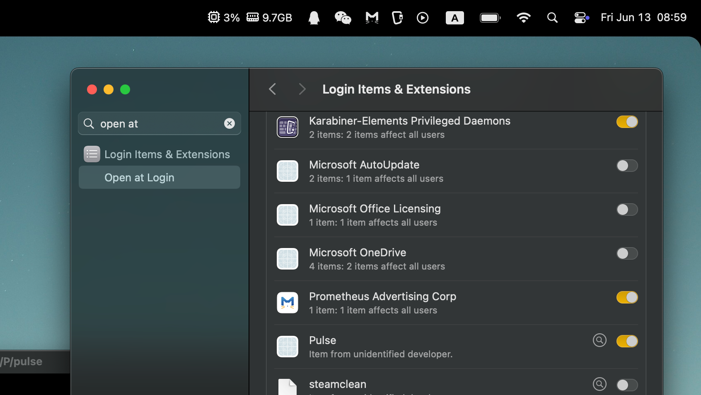

### Pulse
A minimal macOS utility app with resource images.

### Usage

```bash
chmod +x ./build.sh
./build.sh
```

**After building, move the generated .app bundle to your /Applications folder. You can then enable "Open at Login" from System Settings.**







